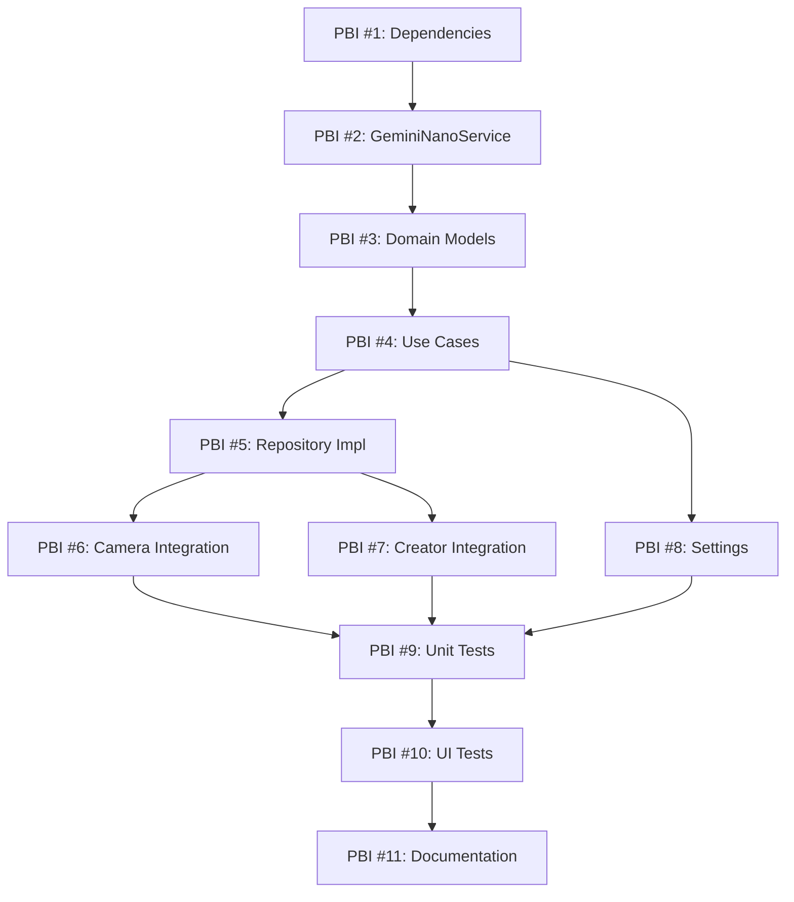

# Tag Suggestions Feature Implementation Plan

## Overview
This document outlines the implementation plan for adding AI-powered tag suggestions to the QR Reader app using ML Kit GenAI APIs with Gemini Nano. This feature will suggest relevant tags for scanned or created QR codes/barcodes based on their content, entirely on-device for privacy and performance.

## Architecture Overview

The implementation will follow the existing Clean Architecture pattern:

```
app/src/main/java/cat/company/qrreader/
├── domain/
│   ├── model/
│   │   └── TagSuggestionModel.kt (NEW)
│   ├── repository/
│   │   └── TagSuggestionRepository.kt (NEW)
│   └── usecase/
│       └── tagsuggestion/
│           ├── GenerateTagSuggestionsUseCase.kt (NEW)
│           └── CheckGeminiNanoAvailabilityUseCase.kt (NEW)
├── data/
│   ├── service/
│   │   └── GeminiNanoService.kt (NEW)
│   └── repository/
│       └── TagSuggestionRepositoryImpl.kt (NEW)
├── features/
│   ├── camera/
│   │   └── presentation/
│   │       └── QrCameraViewModel.kt (MODIFY - add tag suggestions)
│   ├── codeCreator/
│   │   └── presentation/
│   │       └── CodeCreatorViewModel.kt (MODIFY - add tag suggestions)
│   └── settings/
│       └── presentation/
│           └── SettingsViewModel.kt (MODIFY - add toggle)
└── di/
    └── AppModule.kt (MODIFY - add new dependencies)
```

## Implementation Phases

### Phase 1: Foundation & ML Kit Setup
- Epic/PBI 1: Add ML Kit GenAI dependency and configuration
- Epic/PBI 2: Create GeminiNanoService for on-device AI

### Phase 2: Domain Layer
- Epic/PBI 3: Define domain models and repository interface
- Epic/PBI 4: Implement use cases for tag suggestions

### Phase 3: Integration
- Epic/PBI 5: Update camera feature to show tag suggestions
- Epic/PBI 6: Update code creator feature to show tag suggestions
- Epic/PBI 7: Add settings toggle for tag suggestions

### Phase 4: Testing & Polish
- Epic/PBI 8: Write comprehensive unit tests
- Epic/PBI 9: Add UI/instrumentation tests
- Epic/PBI 10: Update documentation and README

---

## Detailed Product Backlog Items (PBIs)

## PBI #1: Add ML Kit GenAI Dependency and Configuration

**Priority:** High  
**Story Points:** 2  
**Labels:** `enhancement`, `dependencies`, `setup`

### Description
Add the ML Kit GenAI library to the project to enable on-device AI capabilities with Gemini Nano. This is the foundation for the tag suggestions feature.

### Acceptance Criteria
- [ ] ML Kit GenAI dependency added to `gradle/libs.versions.toml`
- [ ] Version catalog updated with appropriate version
- [ ] Dependency added to app's `build.gradle` file
- [ ] Project builds successfully with new dependency
- [ ] No conflicts with existing ML Kit Barcode Scanning library
- [ ] Minimum SDK requirements verified (should work with minSdk 29)

### Technical Details

**Files to Modify:**
- `gradle/libs.versions.toml`
- `app/build.gradle`

**Dependencies to Add:**
```toml
# In [versions]
mlkitGenai = "latest_stable_version"

# In [libraries]
google-mlkit-genai = { group = "com.google.mlkit", name = "genai", version.ref = "mlkitGenai" }
```

### Testing
- Build project with `./gradlew build`
- Verify no dependency conflicts
- Check that app still runs on test devices

### Related Issues
None

### Notes
- Check Google's ML Kit documentation for the latest stable version
- Ensure compatibility with existing ML Kit Barcode Scanning library (version 17.3.0)
- Consider adding ProGuard/R8 rules if needed

---

## PBI #2: Create GeminiNanoService for On-Device AI

**Priority:** High  
**Story Points:** 5  
**Labels:** `enhancement`, `core`, `ml`

### Description
Create a service layer component that encapsulates all interactions with ML Kit GenAI and Gemini Nano. This service will handle model availability checks, prompt engineering for tag suggestions, and inference execution.

### Acceptance Criteria
- [ ] `GeminiNanoService` class created in `data/service/` package
- [ ] Service checks Gemini Nano availability on device
- [ ] Service handles model download status
- [ ] Implements tag suggestion generation from barcode content
- [ ] Handles errors gracefully (model unavailable, inference failures)
- [ ] Implements proper prompt engineering for tag suggestions
- [ ] Supports cancellation of inference operations
- [ ] Uses coroutines for async operations
- [ ] Properly injected via Koin

### Technical Details

**File to Create:**
- `app/src/main/java/cat/company/qrreader/data/service/GeminiNanoService.kt`

**Key Methods:**
```kotlin
interface IGeminiNanoService {
    suspend fun isAvailable(): Boolean
    suspend fun checkFeatureStatus(): FeatureStatus
    suspend fun generateTagSuggestions(barcodeContent: String, barcodeType: Int): Result<List<String>>
    fun cancelInference()
}
```

**Implementation Approach:**
1. Use ML Kit GenAI Prompt API for custom prompts
2. Engineer prompts to suggest 3-5 relevant tags based on barcode content
3. Parse LLM response to extract tag suggestions
4. Handle different barcode types (URL, TEXT, CONTACT, etc.)
5. Implement timeout and error handling

**Example Prompt Structure:**
```
Given a QR code containing: "{barcode_content}"
Type: {barcode_type}

Suggest 3-5 short, relevant tags (1-2 words each) that categorize this content.
Return only the tags as a comma-separated list.
Examples: "work, invoice", "personal, contact", "website, shopping"
```

### Testing
- Unit tests for service methods
- Mock Gemini Nano API responses
- Test error handling scenarios
- Test different barcode types

### Related Issues
- Depends on PBI #1

### Notes
- Temperature parameter: 0.2-0.3 for consistent results
- maxOutputTokens: 50 (tags should be short)
- Consider caching suggestions for identical content
- Handle cases where Gemini Nano is not available on device

---

## PBI #3: Define Domain Models and Repository Interface

**Priority:** High  
**Story Points:** 3  
**Labels:** `enhancement`, `domain`, `architecture`

### Description
Create domain layer components following Clean Architecture principles. This includes the domain model for tag suggestions and the repository interface that defines the contract for tag suggestion operations.

### Acceptance Criteria
- [ ] `TagSuggestionModel` data class created in `domain/model/`
- [ ] `TagSuggestionRepository` interface created in `domain/repository/`
- [ ] Models are pure Kotlin (no Android dependencies)
- [ ] Repository interface defines clear contract
- [ ] Models include proper KDoc documentation
- [ ] Follows existing domain layer conventions

### Technical Details

**Files to Create:**

1. `app/src/main/java/cat/company/qrreader/domain/model/TagSuggestionModel.kt`
```kotlin
package cat.company.qrreader.domain.model

/**
 * Domain model for tag suggestions generated by AI
 */
data class TagSuggestionModel(
    val suggestions: List<String>,
    val confidence: Float = 1.0f,
    val sourceContent: String,
    val timestamp: Long = System.currentTimeMillis()
)
```

2. `app/src/main/java/cat/company/qrreader/domain/model/GeminiNanoStatus.kt`
```kotlin
package cat.company.qrreader.domain.model

/**
 * Status of Gemini Nano availability on device
 */
enum class GeminiNanoStatus {
    AVAILABLE,
    DOWNLOADING,
    UNAVAILABLE,
    ERROR
}
```

3. `app/src/main/java/cat/company/qrreader/domain/repository/TagSuggestionRepository.kt`
```kotlin
package cat.company.qrreader.domain.repository

import cat.company.qrreader.domain.model.TagSuggestionModel
import cat.company.qrreader.domain.model.GeminiNanoStatus

/**
 * Repository interface for tag suggestion operations
 */
interface TagSuggestionRepository {
    /**
     * Check if Gemini Nano is available on device
     */
    suspend fun checkAvailability(): GeminiNanoStatus
    
    /**
     * Generate tag suggestions for barcode content
     */
    suspend fun generateSuggestions(
        barcodeContent: String,
        barcodeType: Int
    ): Result<TagSuggestionModel>
}
```

### Testing
- No unit tests needed for data classes and interfaces
- Will be tested through use case tests

### Related Issues
- Depends on PBI #2

### Notes
- Follow naming conventions: `*Model` for domain models
- Keep models immutable (use `data class` with `val`)
- Use `Result` type for operations that can fail

---

## PBI #4: Implement Use Cases for Tag Suggestions

**Priority:** High  
**Story Points:** 3  
**Labels:** `enhancement`, `domain`, `use-case`

### Description
Implement use cases that encapsulate the business logic for tag suggestions. Use cases provide a clean interface between the presentation layer (ViewModels) and the data layer (Repositories).

### Acceptance Criteria
- [ ] `GenerateTagSuggestionsUseCase` created in `domain/usecase/tagsuggestion/`
- [ ] `CheckGeminiNanoAvailabilityUseCase` created in `domain/usecase/tagsuggestion/`
- [ ] Use cases follow single responsibility principle
- [ ] Implement `operator fun invoke()` for clean call syntax
- [ ] Properly handle errors and edge cases
- [ ] Use cases are marked as `open` for testing
- [ ] Registered in Koin's `useCaseModule`

### Technical Details

**Files to Create:**

1. `app/src/main/java/cat/company/qrreader/domain/usecase/tagsuggestion/GenerateTagSuggestionsUseCase.kt`
```kotlin
package cat.company.qrreader.domain.usecase.tagsuggestion

import cat.company.qrreader.domain.model.TagSuggestionModel
import cat.company.qrreader.domain.repository.TagSuggestionRepository

/**
 * Use case for generating tag suggestions for a barcode
 */
open class GenerateTagSuggestionsUseCase(
    private val repository: TagSuggestionRepository
) {
    suspend operator fun invoke(
        barcodeContent: String,
        barcodeType: Int
    ): Result<TagSuggestionModel> {
        return repository.generateSuggestions(barcodeContent, barcodeType)
    }
}
```

2. `app/src/main/java/cat/company/qrreader/domain/usecase/tagsuggestion/CheckGeminiNanoAvailabilityUseCase.kt`
```kotlin
package cat.company.qrreader.domain.usecase.tagsuggestion

import cat.company.qrreader.domain.model.GeminiNanoStatus
import cat.company.qrreader.domain.repository.TagSuggestionRepository

/**
 * Use case for checking Gemini Nano availability
 */
open class CheckGeminiNanoAvailabilityUseCase(
    private val repository: TagSuggestionRepository
) {
    suspend operator fun invoke(): GeminiNanoStatus {
        return repository.checkAvailability()
    }
}
```

**Files to Modify:**
- `app/src/main/java/cat/company/qrreader/di/AppModule.kt`
  - Add to `useCaseModule`:
  ```kotlin
  factory { GenerateTagSuggestionsUseCase(get()) }
  factory { CheckGeminiNanoAvailabilityUseCase(get()) }
  ```

### Testing
- Unit tests for both use cases
- Mock repository responses
- Test success and failure scenarios

### Related Issues
- Depends on PBI #3

### Notes
- Use cases should be thin - no complex logic
- All heavy lifting done in repository/service layer
- Follow existing use case patterns in the codebase

---

## PBI #5: Implement TagSuggestionRepository

**Priority:** High  
**Story Points:** 5  
**Labels:** `enhancement`, `data`, `repository`

### Description
Implement the data layer repository that connects the domain layer with the GeminiNanoService. This repository acts as an adapter between the domain's interface and the actual ML Kit implementation.

### Acceptance Criteria
- [ ] `TagSuggestionRepositoryImpl` created in `data/repository/`
- [ ] Implements `TagSuggestionRepository` interface
- [ ] Delegates to `GeminiNanoService` for AI operations
- [ ] Properly handles exceptions and converts to Result types
- [ ] Uses `Dispatchers.IO` for background operations
- [ ] Registered in Koin's `repositoryModule`

### Technical Details

**File to Create:**
- `app/src/main/java/cat/company/qrreader/data/repository/TagSuggestionRepositoryImpl.kt`

```kotlin
package cat.company.qrreader.data.repository

import cat.company.qrreader.data.service.GeminiNanoService
import cat.company.qrreader.domain.model.GeminiNanoStatus
import cat.company.qrreader.domain.model.TagSuggestionModel
import cat.company.qrreader.domain.repository.TagSuggestionRepository
import kotlinx.coroutines.Dispatchers
import kotlinx.coroutines.withContext

/**
 * Implementation of TagSuggestionRepository
 */
class TagSuggestionRepositoryImpl(
    private val geminiNanoService: GeminiNanoService
) : TagSuggestionRepository {
    
    override suspend fun checkAvailability(): GeminiNanoStatus = withContext(Dispatchers.IO) {
        // Implementation
    }
    
    override suspend fun generateSuggestions(
        barcodeContent: String,
        barcodeType: Int
    ): Result<TagSuggestionModel> = withContext(Dispatchers.IO) {
        // Implementation
    }
}
```

**Files to Modify:**
- `app/src/main/java/cat/company/qrreader/di/AppModule.kt`
  - Add to `repositoryModule`:
  ```kotlin
  single<TagSuggestionRepository> { TagSuggestionRepositoryImpl(get()) }
  single { GeminiNanoService(androidContext()) }
  ```

### Testing
- Unit tests with Robolectric (for Android dependencies)
- Mock GeminiNanoService
- Test error handling and Result types

### Related Issues
- Depends on PBI #2 and PBI #3

### Notes
- Repository handles dispatcher switching, not the ViewModel
- Convert service exceptions to Result.failure()
- Consider adding retry logic for transient failures

---

## PBI #6: Update Camera Feature with Tag Suggestions

**Priority:** High  
**Story Points:** 5  
**Labels:** `enhancement`, `ui`, `feature`

### Description
Integrate tag suggestions into the camera/scanning feature. When a barcode is scanned, automatically generate and display tag suggestions that the user can quickly apply.

### Acceptance Criteria
- [ ] `QrCameraViewModel` updated to request tag suggestions after scan
- [ ] UI displays suggested tags below scanned barcode
- [ ] User can tap suggested tag to apply it
- [ ] Suggestions are dismissible
- [ ] Loading state shown while generating suggestions
- [ ] Gracefully handles when Gemini Nano is unavailable
- [ ] Does not block barcode saving
- [ ] Follows Material3 design patterns

### Technical Details

**Files to Modify:**

1. `app/src/main/java/cat/company/qrreader/features/camera/presentation/QrCameraViewModel.kt`
   - Add `GenerateTagSuggestionsUseCase` dependency
   - Add UI state for tag suggestions
   - Generate suggestions after successful scan

2. `app/src/main/java/cat/company/qrreader/features/camera/presentation/ui/QrCameraScreen.kt` (or similar)
   - Add UI component to display tag suggestions
   - Add tap handlers for applying suggested tags

**UI Design:**
```
┌─────────────────────────────────────┐
│  Scanned: https://example.com       │
│                                     │
│  Suggested tags:                    │
│  ┌─────────┐ ┌──────────┐ ┌──────┐ │
│  │ website │ │ shopping │ │ work │ │
│  └─────────┘ └──────────┘ └──────┘ │
│                                     │
│  [Save] [Cancel]                    │
└─────────────────────────────────────┘
```

**ViewModel State:**
```kotlin
data class QrCameraUiState(
    val scannedBarcode: String? = null,
    val tagSuggestions: List<String> = emptyList(),
    val isLoadingSuggestions: Boolean = false,
    val suggestionsError: String? = null
)
```

### Testing
- Unit tests for ViewModel logic
- UI tests for suggestion display and interaction
- Test suggestion loading states

### Related Issues
- Depends on PBI #4 and PBI #5

### Notes
- Suggestions should not delay barcode saving
- Generate suggestions asynchronously
- Consider adding animation for suggestion appearance
- Limit to 3-5 suggestions for better UX

---

## PBI #7: Update Code Creator Feature with Tag Suggestions

**Priority:** Medium  
**Story Points:** 5  
**Labels:** `enhancement`, `ui`, `feature`

### Description
Integrate tag suggestions into the QR code creation feature. When a user creates a QR code, provide AI-generated tag suggestions based on the content they entered.

### Acceptance Criteria
- [ ] `CodeCreatorViewModel` updated to generate suggestions
- [ ] UI displays suggested tags after content is entered
- [ ] User can apply suggested tags when saving
- [ ] Suggestions update when content changes (with debouncing)
- [ ] Loading state shown while generating
- [ ] Works with all QR code types (URL, text, contact, etc.)
- [ ] Does not block QR code generation

### Technical Details

**Files to Modify:**

1. `app/src/main/java/cat/company/qrreader/features/codeCreator/presentation/CodeCreatorViewModel.kt`
   - Add `GenerateTagSuggestionsUseCase` dependency
   - Add debounced suggestion generation
   - Add UI state for suggestions

2. `app/src/main/java/cat/company/qrreader/features/codeCreator/presentation/ui/*.kt`
   - Add suggestion chips UI component
   - Add interaction handlers

**Debouncing Strategy:**
- Wait 1-2 seconds after user stops typing
- Cancel previous suggestion request when new one starts
- Use `kotlinx.coroutines.flow.debounce()`

### Testing
- Unit tests for ViewModel with debouncing
- UI tests for suggestion interaction
- Test with different QR code types

### Related Issues
- Depends on PBI #4 and PBI #5

### Notes
- Debouncing important to avoid excessive API calls
- Consider caching suggestions for same content
- Show "Generating suggestions..." placeholder

---

## PBI #8: Add Settings Toggle for Tag Suggestions

**Priority:** Medium  
**Story Points:** 3  
**Labels:** `enhancement`, `settings`, `ui`

### Description
Add a user setting to enable/disable the tag suggestions feature. This gives users control and provides a fallback if Gemini Nano is unavailable on their device.

### Acceptance Criteria
- [ ] New setting in DataStore for tag suggestions enabled/disabled
- [ ] Setting displayed in Settings screen
- [ ] Default value is `true` (enabled)
- [ ] Use cases check setting before generating suggestions
- [ ] Setting persists across app restarts
- [ ] UI shows device compatibility status

### Technical Details

**Files to Create:**
1. `app/src/main/java/cat/company/qrreader/domain/usecase/settings/GetTagSuggestionsEnabledUseCase.kt`
2. `app/src/main/java/cat/company/qrreader/domain/usecase/settings/SetTagSuggestionsEnabledUseCase.kt`

**Files to Modify:**
1. `app/src/main/java/cat/company/qrreader/domain/repository/SettingsRepository.kt`
   - Add methods:
   ```kotlin
   fun getTagSuggestionsEnabled(): Flow<Boolean>
   fun setTagSuggestionsEnabled(enabled: Boolean)
   ```

2. `app/src/main/java/cat/company/qrreader/data/repository/SettingsRepositoryImpl.kt`
   - Implement new methods using DataStore

3. `app/src/main/java/cat/company/qrreader/features/settings/presentation/SettingsViewModel.kt`
   - Add state for tag suggestions setting
   - Add toggle handler

4. `app/src/main/java/cat/company/qrreader/features/settings/presentation/ui/SettingsScreen.kt`
   - Add toggle switch UI

**UI Design:**
```
┌─────────────────────────────────────┐
│ Settings                            │
│                                     │
│ AI Features                         │
│ ┌─────────────────────────────────┐ │
│ │ Tag Suggestions          [ON ▼] │ │
│ │ Use AI to suggest tags           │ │
│ │ Status: Available ✓              │ │
│ └─────────────────────────────────┘ │
└─────────────────────────────────────┘
```

### Testing
- Unit tests for use cases
- Test setting persistence
- UI tests for toggle interaction

### Related Issues
- Depends on PBI #4

### Notes
- Show helpful message if Gemini Nano unavailable
- Consider showing first-time user tip about the feature
- Add link to learn more about on-device AI

---

## PBI #9: Write Comprehensive Unit Tests

**Priority:** High  
**Story Points:** 5  
**Labels:** `testing`, `quality`

### Description
Write comprehensive unit tests for all new components following the existing testing patterns in the codebase. Ensure high code coverage and test edge cases.

### Acceptance Criteria
- [ ] Unit tests for `GeminiNanoService` (mocking ML Kit)
- [ ] Unit tests for `TagSuggestionRepositoryImpl`
- [ ] Unit tests for `GenerateTagSuggestionsUseCase`
- [ ] Unit tests for `CheckGeminiNanoAvailabilityUseCase`
- [ ] Unit tests for updated ViewModels
- [ ] All tests pass in CI/CD pipeline
- [ ] Code coverage >80% for new code
- [ ] Tests follow existing patterns (JUnit4, coroutines-test)

### Technical Details

**Test Files to Create:**

1. `app/src/test/java/cat/company/qrreader/data/service/GeminiNanoServiceTest.kt`
   - Mock ML Kit APIs
   - Test availability checks
   - Test suggestion generation
   - Test error handling

2. `app/src/test/java/cat/company/qrreader/data/repository/TagSuggestionRepositoryImplTest.kt`
   - Use Robolectric for Android dependencies
   - Mock GeminiNanoService
   - Test Result types

3. `app/src/test/java/cat/company/qrreader/domain/usecase/tagsuggestion/GenerateTagSuggestionsUseCaseTest.kt`
   - Mock repository
   - Test invoke operator

4. `app/src/test/java/cat/company/qrreader/features/camera/presentation/QrCameraViewModelTest.kt` (UPDATE)
   - Test suggestion generation after scan
   - Test loading states

**Testing Patterns:**
```kotlin
@Before
fun setUp() {
    Dispatchers.setMain(StandardTestDispatcher())
}

@After
fun tearDown() {
    Dispatchers.resetMain()
}

@Test
fun `generateSuggestions_success_returnsSuggestions`() = runTest {
    // Arrange
    val mockRepository = mock<TagSuggestionRepository>()
    val useCase = GenerateTagSuggestionsUseCase(mockRepository)
    
    // Act
    val result = useCase("https://example.com", Barcode.TYPE_URL)
    
    // Assert
    assertTrue(result.isSuccess)
}
```

### Testing
- Run with `./gradlew testDebugUnitTest`
- Generate coverage report with `./gradlew jacocoTestReport`
- Verify no test failures in CI

### Related Issues
- Depends on all implementation PBIs

### Notes
- Use test doubles (fakes) where appropriate
- Follow AAA pattern (Arrange, Act, Assert)
- Test edge cases and error scenarios
- Mock external dependencies (ML Kit)

---

## PBI #10: Add UI/Instrumentation Tests

**Priority:** Medium  
**Story Points:** 3  
**Labels:** `testing`, `ui`, `quality`

### Description
Add instrumented tests for the UI components related to tag suggestions. These tests verify the end-to-end functionality on actual devices.

### Acceptance Criteria
- [ ] Instrumented tests for camera scan with suggestions
- [ ] Instrumented tests for code creator with suggestions
- [ ] Instrumented tests for settings toggle
- [ ] Tests use Compose Test APIs
- [ ] Tests pass on emulator/device
- [ ] Tests added to CI pipeline

### Technical Details

**Test Files to Create:**

1. `app/src/androidTest/java/cat/company/qrreader/features/camera/TagSuggestionsCameraTest.kt`
   - Test suggestion display after scan
   - Test applying suggested tag
   - Test dismissing suggestions

2. `app/src/androidTest/java/cat/company/qrreader/features/codeCreator/TagSuggestionsCreatorTest.kt`
   - Test suggestion generation
   - Test applying suggestions

3. `app/src/androidTest/java/cat/company/qrreader/features/settings/TagSuggestionsSettingsTest.kt`
   - Test toggle functionality
   - Test setting persistence

**Example Test:**
```kotlin
@Test
fun tagSuggestions_displayedAfterScan() {
    composeTestRule.setContent {
        QrCameraScreen(/* params */)
    }
    
    // Trigger scan
    // Verify suggestions appear
    composeTestRule.onNodeWithText("Suggested tags:").assertIsDisplayed()
}
```

### Testing
- Run with `./gradlew connectedAndroidTest`
- Test on different Android versions if possible

### Related Issues
- Depends on PBI #6, PBI #7, PBI #8

### Notes
- May need to mock ML Kit responses for consistent tests
- Use `createComposeRule()` for Compose tests
- Consider using test tags for easier element selection

---

## PBI #11: Update Documentation

**Priority:** Medium  
**Story Points:** 2  
**Labels:** `documentation`

### Description
Update project documentation to reflect the new tag suggestions feature, including README, AGENTS.md, and inline code documentation.

### Acceptance Criteria
- [ ] README.md updated with feature description
- [ ] AGENTS.md updated with new architecture components
- [ ] All new classes have comprehensive KDoc
- [ ] Dependencies documented in AGENTS.md
- [ ] User-facing documentation for tag suggestions feature
- [ ] Technical documentation for future developers

### Technical Details

**Files to Update:**

1. `README.md`
   - Add tag suggestions to feature list
   - Mention Gemini Nano requirement
   - Add screenshots if available

2. `AGENTS.md`
   - Document new architecture layers
   - Add ML Kit GenAI to technology stack
   - Document new use cases and repositories
   - Add testing guidelines for ML components

3. Inline KDoc
   - All new classes
   - All new methods
   - Explain AI/ML concepts for future maintainers

**Example README Update:**
```markdown
## Features
- QR code and barcode scanning
- QR code generation
- **AI-powered tag suggestions** - Uses on-device Gemini Nano to suggest relevant tags
- Barcode history with tagging
- Settings and preferences
```

### Testing
- Review documentation for clarity
- Verify all links work
- Ensure code examples are correct

### Related Issues
- Should be done last, after all features implemented

### Notes
- Keep documentation up-to-date with code changes
- Include examples and use cases
- Explain device requirements for Gemini Nano

---

## Implementation Order & Dependencies



## Timeline Estimate

Based on story points (assuming 1 SP = 2-3 hours):

- **Phase 1 (Setup)**: PBI #1-2 = 7 SP ≈ 2-3 days
- **Phase 2 (Domain)**: PBI #3-5 = 11 SP ≈ 3-4 days  
- **Phase 3 (Integration)**: PBI #6-8 = 13 SP ≈ 4-5 days
- **Phase 4 (Testing & Docs)**: PBI #9-11 = 10 SP ≈ 3-4 days

**Total**: 41 SP ≈ **12-16 days** for a single developer

## Risk Assessment

### High Risk
- **Gemini Nano availability**: Not all devices support it
  - *Mitigation*: Add feature detection, graceful degradation
  
- **ML Kit API changes**: APIs are relatively new
  - *Mitigation*: Pin specific versions, monitor Google updates

### Medium Risk
- **Prompt engineering quality**: Suggestions might not be relevant
  - *Mitigation*: Iterate on prompts, add user feedback mechanism

- **Performance impact**: AI inference might be slow
  - *Mitigation*: Make async, add timeouts, show loading states

### Low Risk
- **Integration with existing features**: Well-defined interfaces
  - *Mitigation*: Follow Clean Architecture, comprehensive testing

## Success Metrics

- Tag suggestions feature available to 80%+ of users (device support)
- Suggestion generation completes in <2 seconds on supported devices
- 50%+ of users enable and use tag suggestions
- No regressions in existing features
- Code coverage remains >70%

## Future Enhancements

After initial implementation, consider:
- Learning from user's manual tag choices to improve suggestions
- Supporting multiple languages for suggestions
- Allowing users to provide feedback on suggestion quality
- Suggesting tag combinations based on history
- Offline caching of common suggestions
